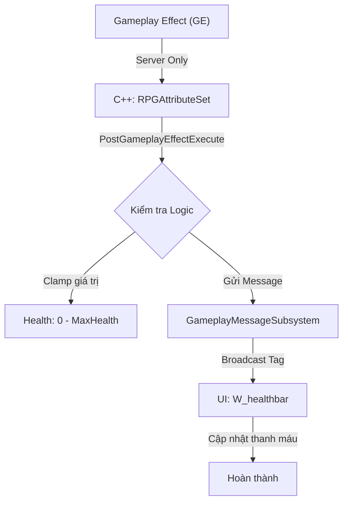
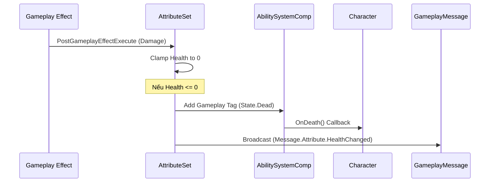

# Quy trình Triển khai Attribute Set (Chỉ số Nhân vật) C++

Tài liệu này hướng dẫn chi tiết luồng logic và cấu trúc mã nguồn để thiết lập hệ thống chỉ số (Health, Mana, Stamina) bằng C++, tích hợp chuẩn xác với Lyra Gameplay Messaging.

## 🔄 Luồng Logic Cấp cao



---

## 💻 Kiến trúc Hệ thống

### 1. Authority & Replication
- **Server**: Chịu trách nhiệm 100% về logic Attribute. `PostGameplayEffectExecute` chỉ chạy trên Server.
- **Client**: Nhận dữ liệu Attribute thông qua Replication và nhận Gameplay Message để cập nhật HUD.
- **Rule**: Không bao giờ broadcast message thủ công từ Client.

### 2. So sánh PreAttributeChange vs PostGameplayEffectExecute
| Hàm | Khi nào gọi | Mục đích sử dụng |
| :--- | :--- | :--- |
| **PreAttributeChange** | Trước khi giá trị được set | Xử lý Clamping khi **MaxAttribute** thay đổi (ví dụ: Tăng MaxHP). |
| **PostGameplayEffectExecute** | Sau khi GE được áp dụng | Xử lý hậu quả của Damage/Heal. Kích hoạt Death logic. |

### 3. Logic Clamping cho Max Attribute thay đổi
Đoạn code này cực kỳ quan trọng để tránh lỗi lệch máu khi Buff/Debuff MaxHealth:
```cpp
void URPGAttributeSet::PreAttributeChange(const FGameplayAttribute& Attribute, float& NewValue)
{
    if (Attribute == GetMaxHealthAttribute())
    {
        AdjustAttributeForMaxChange(Health, MaxHealth, NewValue, GetHealthAttribute());
    }
}
```

---

## 💀 Logic Khi Máu về 0 (Death Sequence)



---

## 🏷️ Quy ước đặt tên và Tag Scope
| Loại | Ví dụ Tag | Mục đích |
| :--- | :--- | :--- |
| **Attribute** | `Attribute.Health` | Định danh thuộc tính cho GE |
| **Message** | `Message.Attribute.HealthChanged` | Truyền tin cho UI/VFX |
| **State** | `State.Dead` | Trạng thái gameplay |
| **Event** | `Event.Montage.Death` | Kích hoạt hiệu ứng |

---

## ⚙️ Quy trình triển khai 5 Bước

### Bước 1: Khai báo C++ (Header)
Sử dụng macro `ATTRIBUTE_ACCESSORS` để tạo Getter/Setter.
- Khai báo: `Health`, `MaxHealth`, `Mana`, `MaxMana`.

### Bước 2: Implement Logic Clamping (Source)
Override `PreAttributeChange` để xử lý thay đổi Max và `PostGameplayEffectExecute` để xử lý Damage.

### Bước 3: Gameplay Message Contract
Tạo struct `FRPGAttributeChangedMessage` chứa: `Owner`, `NewValue`, `MaxValue`.
- **Lưu ý**: Message này chỉ dùng cho UI/VFX/Audio. Không dùng Message để kích hoạt logic Death.

### Bước 4: Tích hợp Game Data
`RPGHero_Character` sẽ nạp giá trị từ `URPGGameData` vào ASC khi khởi tạo.

### Bước 5: Cấu hình HUD
- Widget lắng nghe Tag `Message.Attribute.HealthChanged`.
- Luôn đảm bảo UI là "Consumer" cuối cùng, không điều khiển ngược lại gameplay.

---

## 🎨 Cấu hình trong Unreal Editor

Sau khi hoàn tất phần code C++, bạn cần thực hiện các bước cấu hình sau trong Editor để kích hoạt hệ thống:

### 1. Đăng ký Attribute trong Pawn Data
Mở file **HeroPawnData** (ví dụ: `HeroPawnData`):
- Tại mục **Attributes**, bấm dấu `+`.
- Chọn Class: `RPGAttributeSet`.
- *Việc này đảm bảo khi nhân vật sinh ra, ASC sẽ tự động tạo và quản lý bộ chỉ số này.*

### 2. Cấu hình Giá trị mặc định (RPG Game Data)

Hệ thống sử dụng **RPG Game Data** để quản lý các chỉ số khởi tạo toàn cục. 

**Trạng thái hiện tại:** Đã tạo và đăng ký thành công.

- **Asset:** `DA_RPGGameData` (nằm trong thư mục `/Content/`).
- **Cấu hình trong `DefaultGame.ini`:**
  ```ini
  [/Script/RPGRuntime.RPGAssetManager]
  RPGGameDataPath="/Game/DA_RPGGameData.DA_RPGGameData"
  ```

**Cách chỉnh sửa chỉ số:**
1. Mở file **DA_RPGGameData** trong Editor.
2. Tại mục **Default Attributes**, bạn có thể thay đổi các giá trị:
   - `Default Health`, `Default Max Health`
   - `Default Mana`, `Default Max Mana`
   - `Default Stamina`, `Default Max Stamina`
3. Các giá trị này sẽ được C++ tự động nạp vào nhân vật khi sinh ra (thông qua hàm khởi tạo `RPGAttributeSet`).

### 4. Cơ chế Kiểm thử (Gameplay Abilities & Input)

Để xác nhận hệ thống Attribute hoạt động chính xác, chúng ta sẽ tạo một "vòng lặp kiểm thử" cho phép thay đổi máu của nhân vật thông qua phím bấm.

#### A. Tạo Gameplay Abilities & Effects
1. **GE_SelfDamage**:
   - Class cha: `GameplayEffect`.
   - **Duration Policy**: `Instant`.
   - **Modifier**: Attribute: `RPGAttributeSet.Health`, Op: `Add`, Magnitude: `-5.0`.
2. **GA_SelfDamage**:
   - Class cha: **`RPGGameplayAbility`** (hoặc `LyraGameplayAbility`).
   - **Logic**: `ApplyGameplayEffectToOwner(GE_SelfDamage)` -> `EndAbility`.
   - **Activation Policy**: `OnInputTriggered`.
3. **GE_SelfHeal / GA_SelfHeal**: Làm tương tự với Magnitude: `+5.0`.

#### B. Thiết lập Input System
1. **Input Actions**: Tạo `IA_SelfDamage` và `IA_SelfHeal` (Digital). Thêm Trigger: `Pressed`.
2. **Input Mapping Context**: Tạo `IMC_RPGCore`, gán:
   - `IA_SelfDamage` -> Chuột trái (Left Mouse Button).
   - `IA_SelfHeal` -> Chuột phải (Right Mouse Button).
3. **Input Config**: Tạo `InputData_RPG_Addons` (Cha: **`RPGInputConfig`**).
   - Liên kết: `IA_SelfDamage` -> Tag `InputTag.SelfDamage`.
   - Liên kết: `IA_SelfHeal` -> Tag `InputTag.SelfHeal`.

#### C. Liên kết với Experience (Action Set)
1. **Experience Action Set**: Tạo `LAS_RPG_SharedInput` (Cha: **`RPGExperienceActionSet`**).
   - **Actions**: 
     - `Add Input Binds`: Chọn `InputData_RPG_Addons`.
     - `Add Input Mapping`: Chọn `IMC_RPGCore`.
2. **RPG Experience**: Mở `RPG_Experience` (ví dụ: `B_RPGDefaultExperience`), thêm `LAS_RPG_SharedInput` vào mục **Action Sets**.

#### D. Gán Abilities cho Vũ khí (Axe)
1. **Ability Set**: Tạo `AbilitySet_Axe` (Cha: `RPGAbilitySet`).
   - Thêm `GA_SelfDamage` -> Tag `InputTag.SelfDamage`.
   - Thêm `GA_SelfHeal` -> Tag `InputTag.SelfHeal`.
2. **Weapon Item Definition**: Mở `WID_Axe` (kế thừa từ **`RPGEquipmentDefinition`**):
   - Tại mục **Equipment**, tìm mảng **Ability Sets to Grant**.
   - Thêm `AbilitySet_Axe` vào mảng này.
3. **Pawn Data (Tự động cầm vũ khí)**: 
   - Mở **`DA_RPGPawnData`**.
   - Thêm **`WID_Axe`** vào mục **Initial Equipment**.

---

## ✅ Checklist Kiểm tra Attribute & Logic
- [ ] **Pawn Data**: `RPGAttributeSet` đã được thêm vào chưa?
- [ ] **Game Data**: Các giá trị khởi tạo đã điền trong `DA_RPGGameData` chưa?
- [ ] **Clamping**: Khi máu về 0, nhân vật có nhận được Tag `Status.Dead` không?
- [ ] **Input**: Bấm chuột trái/phải nhân vật có thực hiện GA và đổi màu (nếu có effect) không?
- [ ] **Debug**: Gõ lệnh `showdebug abilitysystem` để xem các chỉ số thực tế trên Server.

---
## 📺 Các giai đoạn tiếp theo (Roadmap)
1. **UI Architecture**: Xem tài liệu `RPG_Workflow_UI_Architecture.md`.
2. **Death System**: Chi tiết quy trình tại [RPG_Workflow_Death.md](file:///f:/UnrealProject/LyraRPG/Lyra/Plugins/GameFeatures/RPG/Source/RPGRuntime/docs/Attributes/RPG_Workflow_Death.md).
3. **Stamina System**: Hệ thống thể lực và các hành động tiêu tốn thể lực.

