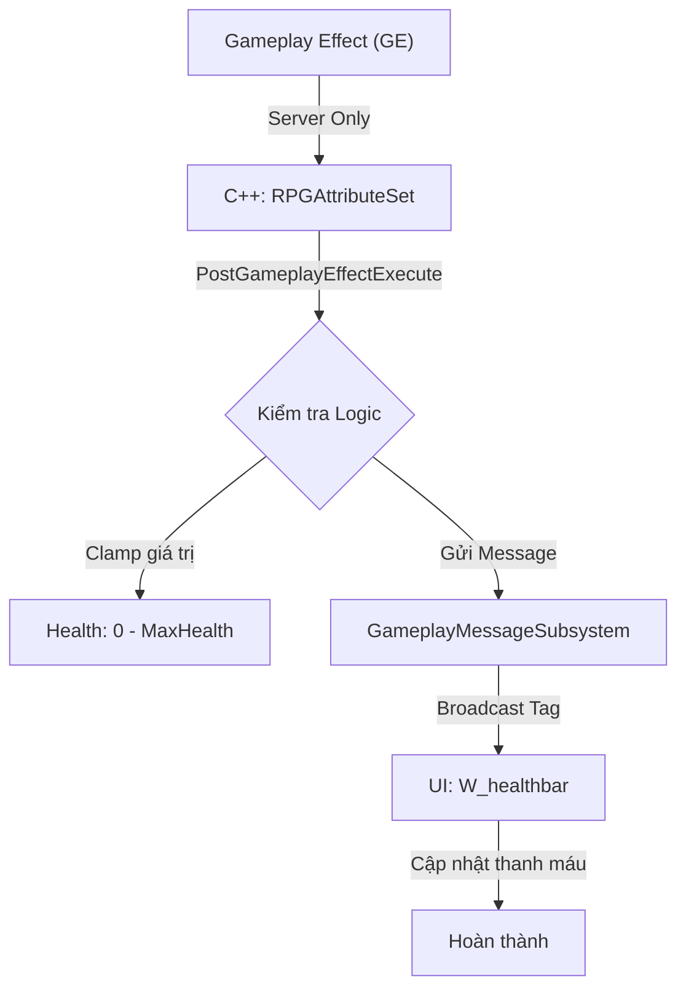
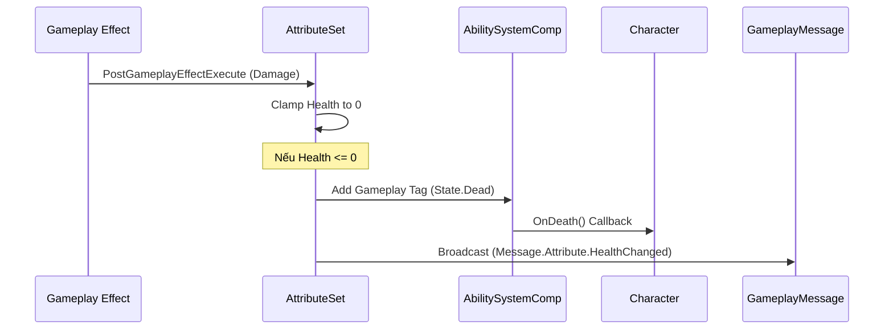

# Quy trình Triển khai Attribute Set (Chỉ số Nhân vật) C++

Tài liệu này hướng dẫn chi tiết luồng logic và cấu trúc mã nguồn để thiết lập hệ thống chỉ số (Health, Mana, Stamina) bằng C++, tích hợp chuẩn xác với Lyra Gameplay Messaging.

## 🔄 Luồng Logic Cấp cao



---

## 💻 Kiến trúc Hệ thống

### 1. Authority & Replication
- **Server**: Chịu trách nhiệm 100% về logic Attribute. `PostGameplayEffectExecute` chỉ chạy trên Server.
- **Client**: Nhận dữ liệu Attribute thông qua Replication và nhận Gameplay Message để cập nhật HUD.
- **Rule**: Không bao giờ broadcast message thủ công từ Client.

### 2. So sánh PreAttributeChange vs PostGameplayEffectExecute
| Hàm | Khi nào gọi | Mục đích sử dụng |
| :--- | :--- | :--- |
| **PreAttributeChange** | Trước khi giá trị được set | Xử lý Clamping khi **MaxAttribute** thay đổi (ví dụ: Tăng MaxHP). |
| **PostGameplayEffectExecute** | Sau khi GE được áp dụng | Xử lý hậu quả của Damage/Heal. Kích hoạt Death logic. |

### 3. Logic Clamping cho Max Attribute thay đổi
Đoạn code này cực kỳ quan trọng để tránh lỗi lệch máu khi Buff/Debuff MaxHealth:
```cpp
void URPGAttributeSet::PreAttributeChange(const FGameplayAttribute& Attribute, float& NewValue)
{
    if (Attribute == GetMaxHealthAttribute())
    {
        AdjustAttributeForMaxChange(Health, MaxHealth, NewValue, GetHealthAttribute());
    }
}
```

---

## 💀 Logic Khi Máu về 0 (Death Sequence)



---

## 🏷️ Quy ước đặt tên và Tag Scope
| Loại | Ví dụ Tag | Mục đích |
| :--- | :--- | :--- |
| **Attribute** | `Attribute.Health` | Định danh thuộc tính cho GE |
| **Message** | `Message.Attribute.HealthChanged` | Truyền tin cho UI/VFX |
| **State** | `State.Dead` | Trạng thái gameplay |
| **Event** | `Event.Montage.Death` | Kích hoạt hiệu ứng |

---

## ⚙️ Quy trình triển khai 5 Bước

### Bước 1: Khai báo C++ (Header)
Sử dụng macro `ATTRIBUTE_ACCESSORS` để tạo Getter/Setter.
- Khai báo: `Health`, `MaxHealth`, `Mana`, `MaxMana`.

### Bước 2: Implement Logic Clamping (Source)
Override `PreAttributeChange` để xử lý thay đổi Max và `PostGameplayEffectExecute` để xử lý Damage.

### Bước 3: Gameplay Message Contract
Tạo struct `FRPGAttributeChangedMessage` chứa: `Owner`, `NewValue`, `MaxValue`.
- **Lưu ý**: Message này chỉ dùng cho UI/VFX/Audio. Không dùng Message để kích hoạt logic Death.

### Bước 4: Tích hợp Game Data
`RPGHero_Character` sẽ nạp giá trị từ `URPGGameData` vào ASC khi khởi tạo.

### Bước 5: Cấu hình HUD
- Widget lắng nghe Tag `Message.Attribute.HealthChanged`.
- Luôn đảm bảo UI là "Consumer" cuối cùng, không điều khiển ngược lại gameplay.

---

## 🎨 Cấu hình trong Unreal Editor

Sau khi hoàn tất phần code C++, bạn cần thực hiện các bước cấu hình sau trong Editor để kích hoạt hệ thống:

### 1. Đăng ký Attribute trong Pawn Data
Mở file **PawnData_Hero** (ví dụ: `DA_RPGHeroData`):
- Tại mục **Attributes**, bấm dấu `+`.
- Chọn Class: `RPGAttributeSet`.
- *Việc này đảm bảo khi nhân vật sinh ra, ASC sẽ tự động tạo và quản lý bộ chỉ số này.*

### 2. Cấu hình Giá trị mặc định (RPG Game Data)
Mở file **DA_RPGGameData**:
- Thiết lập các giá trị khởi tạo cho Health, Mana, Stamina.
- Các giá trị này sẽ được C++ đọc và nạp vào Attribute Set thông qua hàm khởi tạo.

### 3. Thiết lập HUD Layout & Health Bar
1. **HUD Layout**: Mở Blueprint HUD của bạn (kế thừa từ `LyraHUDLayout`).
2. **Thêm Slot**: Thêm một `Common UI Widget Slot` hoặc kéo trực tiếp `W_healthbar` vào canvas.
3. **Widget Binding**:
   - Chọn `W_healthbar`.
   - Trong bảng **Details**, tìm mục **Binding/Tag**.
   - Gán Tag lắng nghe: `Message.Attribute.HealthChanged`.

### 4. Tạo Gameplay Effects (GE) thực tế
Tạo các Data Asset thuộc lớp `GameplayEffect`:
- **GE_Heal_Instant**: Modifier = `Health`, Op = `Add`, Magnitude = `20`.
- **GE_Damage_Over_Time**: Duration = `5.0s`, Modifier = `Health`, Op = `Add`, Magnitude = `-2`.

---

## ✅ Checklist Hoàn tất
- [ ] Attribute Set đã được thêm vào **Pawn Data**.
- [ ] Giá trị khởi tạo đã được điền trong **RPG Game Data**.
- [ ] `W_healthbar` trong HUD đã được gán Tag Message chuẩn xác.
- [ ] Attribute được Clamping đúng (0 - Max).
- [ ] Thay đổi MaxHealth không làm sai lệch tỷ lệ Health hiện tại.
- [ ] Logic Death chạy dựa trên Tag/Attribute, không dựa trên Message.
- [ ] HUD chỉ cập nhật khi nhận được Message từ Server.
- [ ] `showdebug abilitysystem` hiển thị đúng danh sách chỉ số.

---
*Tài liệu này được tối ưu hóa cho kiến trúc Multiplayer/Standalone của Lyra.*
