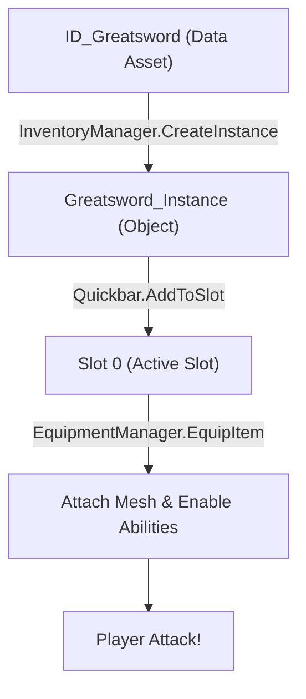

# Quy trình Triển khai và Luồng Hoạt động Vũ khí (Play → Greatsword)

Tài liệu này hướng dẫn chi tiết quy trình triển khai trong Unreal Editor và giải thích luồng hoạt động từ khi bấm Play đến khi sử dụng vũ khí.

## 📊 Tổng quan Luồng Hoạt động (0 → 9 giây+)

| Giai đoạn | Thời gian | Hành động chính | Mục đích |
| :--- | :--- | :--- | :--- |
| **1. Khởi động** | 0-3s | Tải Experience & Action Set | Thiết lập quy tắc game & Components nền tảng |
| **2. Sinh nhân vật** | 3-5s | Possess & Wait Ready | Kết nối Controller với Character |
| **3. Kiểm tra** | 5-7s | Inventory Ready Check | Đảm bảo hệ thống quản lý đã sẵn sàng |
| **4. Trang bị** | 7-9s | Create Instance & Equip | Tạo vật phẩm thực tế và gắn vào tay |
| **5. Sử dụng** | 9s+ | Combat Input | Thực hiện đòn đánh và kỹ năng |

---

> [!NOTE]
> Để xem danh sách các Class C++ Framework hỗ trợ, vui lòng tham khảo [RPG_Standalone_Framework.md](file:///f:/UnrealProject/LyraRPG/Lyra/Plugins/GameFeatures/RPG/Source/RPGRuntime/docs/RPG_Standalone_Framework.md).

---

## Quy trình triển khai trong Unreal Editor (Axe Implementation)

### 1. Cấu hình Game Feature Data Asset
Mở file **RPG_Core** (Game Feature Data Asset). Tại mục **Actions**, thêm **Add Components**:
- **Component 1 (Quản lý Trang bị):**
    - Actor Class: `RPGCharacter` 
    - Component Class: `RPGEquipmentManagerComponent`
    - Cấu hình: Bật cả **Server** và **Client**.
- **Component 2 (Quản lý Kho đồ):**
    - Actor Class: `Controller`
    - Component Class: `RPGInventoryManagerComponent`
    - Cấu hình: Bật cả **Server** và **Client**.


### 2. Cấu hình Asset Manager
Trong **Project Settings**, đảm bảo Asset Manager có thể quét các Experience và Action Set mới:
- **Primary Asset Type:** `RPGExperienceDefinition`
    - Asset Base Class: `RPGExperienceDefinition`
    - Directory: `/RPG/Experiences/`
- **Primary Asset Type:** `RPGExperienceActionSet`
    - Asset Base Class: `RPGExperienceActionSet`
    - Directory: `/RPG/Experiences/`

---

## ⚙️ Cấu hình hệ thống (Config.ini)
Để Lyra nhận diện được logic của RPG Plugin, bạn cần ghi đè các cấu hình sau trong thư mục `Config/` của Project:

### 1. DefaultEngine.ini
Kích hoạt Asset Manager tùy chỉnh của RPG:
```ini
[/Script/Engine.Engine]
AssetManagerClassName=/Script/RPGRuntime.RPGAssetManager
```

### 2. DefaultGame.ini
Cấu hình đường dẫn Game Data và hướng dẫn Asset Manager quét các loại Asset của RPG:
```ini
[/Script/RPGRuntime.RPGAssetManager]
RPGGameDataPath="/Game/RPG/Data/DA_RPGGameData"

[/Script/Engine.AssetManagerSettings]
+PrimaryAssetTypesToScan=(PrimaryAssetType="RPGExperienceDefinition",AssetBaseClass=/Script/RPGRuntime.RPGExperienceDefinition,bHasBlueprintClasses=True,bIsEditorOnly=False,bDirectoriesShowBackslashes=True)
+PrimaryAssetTypesToScan=(PrimaryAssetType="RPGExperienceActionSet",AssetBaseClass=/Script/RPGRuntime.RPGExperienceActionSet,bHasBlueprintClasses=True,bIsEditorOnly=False,bDirectoriesShowBackslashes=True)
```

### 3. RPG.uplugin
Đảm bảo RPG.uplugin Plugin không bị tải chồng chéo bằng cách thiết lập:
```json
"ExplicitlyLoaded": false
```
*Lưu ý: Thiết lập này giúp hệ thống Game Feature của Lyra quản lý việc kích hoạt plugin một cách chuẩn xác hơn.*

---

### 3. Tạo Action Set cho Quickbar
Tại thư mục `/RPG/Experiences/`, tạo Data Asset kế thừa từ `RPGExperienceActionSet`. Tên: **LAS_RPG_SharedComponents**.
- **Action - Add Component:**
    - Actor Class: `Controller`
    - Component Class: `RPGQuickbarComponent`
    - Cấu hình: Bật cả **Server** và **Client**.
- **GameFeaturesToEnable:** Thêm `RPG`.


### 4. Gán Action Set vào Experience
Mở **B_RPG_Experience** (Experience Definition).
- Trong mục **Action Sets**, thêm **LAS_RPG_SharedComponents** vào danh sách.


### 5. Node Kiểm tra Trạng thái Sẵn sàng
Sử dụng node C++ **Wait For Inventory Ready** đã được tích hợp sẵn:
- Class: `RPGAsyncAction_WaitForInventoryReady`
- Node: `Wait For Inventory Ready` -> Pin: `On Ready`.

> [!NOTE]
> **Logic vận hành:** Node này thực hiện "polling" (kiểm tra lặp lại mỗi 0.1s) trên Controller của Pawn để tìm `RPGInventoryManagerComponent` và `RPGQuickbarComponent`. Chỉ khi cả hai đã được đính kèm thành công thì luồng logic mới tiếp tục.

---

## 🔍 Chi tiết Luồng Dữ liệu thực tế



### Tại sao cần kiến trúc này?
1. **Modularity**: Mỗi hệ thống (Inventory, Quickbar, Equipment) hoạt động độc lập.
2. **Network Replication**: Tối ưu hóa việc truyền tin trong mạng (Inventory ít thay đổi, Equipment thay đổi liên tục).
3. **Extensibility**: Dễ dàng thêm các loại vật phẩm mới (Consumables chỉ cần Inventory, Weapons cần cả 3).

### 6. Logic Kho đồ C++
Class `RPGHero_Character` đã được tích hợp sẵn logic tự động:
- **Biến `InitialInventoryItems`**: Xuất hiện trong Category `RPG|Inventory` của Blueprint.
- **Cơ chế**: Tự động đợi Inventory và Quickbar sẵn sàng sau khi Possess, sau đó Grant item và gán vào Slot 0.


### 7. Áp dụng thực tế cho Axe
Tại Blueprint nhân vật cụ thể (ví dụ: **B_HeroRPG**):
1. Đảm bảo Blueprint kế thừa từ `RPGHero_Character`.
2. Tại mục **Details**, tìm mảng **Initial Inventory Items**.
3. Thêm một phần tử và gán **ID_Axe** (Data Asset).
4. **Xong!** Hệ thống C++ sẽ tự động xử lý việc trang bị khi bạn nhấn Play.

### 8. Thiết lập logic Nhân vật chuyên biệt (RPGHero_Character)
Kế thừa từ `RPGCharacter` để tạo Class C++ `RPGHero_Character` hỗ trợ các tính năng nâng cao:

#### A. Logic Xử lý Cái chết (Death Logic)
Hệ thống tự động thực hiện các bước sau khi máu về 0 (On Death Started):
1. **Phát hoạt ảnh (Animation)**: Chọn ngẫu nhiên một Montage từ danh sách `Death Montages` được gán trong Blueprint.
2. **Xử lý AI**: Tự động Unregister khỏi giác quan của AI (`AISense_Sight`) để kẻ địch không tiếp tục tấn công xác chết.
3. **Độ trễ vật lý (Ragdoll Delay)**: Chờ một khoảng thời gian ngẫu nhiên (0.1s - 0.6s) trước khi kích hoạt Ragdoll để cú ngã trông tự nhiên hơn.
4. **Ẩn vũ khí**: Tự động gọi `SetAllWeaponsHidden(true)` để ẩn các vũ khí đang cầm, tránh lỗi hiển thị khi xác nằm trên đất.
5. **Kích hoạt Ragdoll**: Chuyển Mesh sang trạng thái vật lý hoàn toàn.

#### B. Hệ thống Hiệu ứng Bước chân (Footstep Effects)
Sử dụng Interface `RPGContextEffectsInterface` để quản lý hiệu ứng:
1. **Tách biệt Actor**: Sử dụng một Actor riêng (`B_Foot_Step`) để quản lý hiệu ứng. Điều này đảm bảo bụi và âm thanh không bị biến mất đột ngột khi nhân vật chết hoặc Respawn.
2. **Kích hoạt từ Anim Notify**: Sự kiện `AnimMotionEffect` truyền dữ liệu từ Animation vào Actor hiệu ứng thông qua Interface.
3. **Tham số hỗ trợ**: Hỗ trợ Bone, Motion Effect Tag, Location Offset, VFX Scale, Audio Volume/Pitch.

### 9. Khắc phục lỗi lệch Vũ khí (Blender & Unreal Style)
Trong 90% trường hợp lệch “một góc lớn”, nguyên nhân là do Pivot của Mesh bị sai. Thay vì cố gắng chỉnh Socket "chữa cháy", hãy chuẩn hóa lại ngay từ Blender để đạt được sự ổn định lâu dài.

#### A. Mục tiêu trong Blender
- **Pivot (Origin)**: Phải nằm đúng tại điểm nắm tay (Grip).
- **Trục Forward**: Hướng X+ theo hướng đánh.
- **Kết quả**: Gắn vào socket trong Unreal KHÔNG cần chỉnh rotation (Rotation = 0,0,0).

#### B. Quy trình chỉnh sửa trong Blender
1. **Chuẩn trục Unreal (Quan trọng)**: Unreal dùng hệ trục X+ (Forward), Y+ (Right), Z+ (Up).
2. **Căn chỉnh Mesh**:
   - Xoay mesh sao cho: Lưỡi rìu hướng về **+X**, Cán hướng về **-X**, Mặt phẳng lưỡi nằm trong **X-Z**.
3. **Đặt Pivot tại Grip**:
   - Trong *Edit Mode*, chọn các vertex tại điểm tay nắm -> `Shift + S` -> **Cursor to Selected**.
   - Quay lại *Object Mode* -> **Object** -> **Set Origin** -> **Origin to 3D Cursor**.
4. **Apply Transform (Bắt buộc)**:
   - `Ctrl + A` -> Chọn **Rotation** và **Scale**.
   - **Lưu ý**: KHÔNG apply Location. Location của mesh phải là (0,0,0).

#### C. Khắc phục lỗi lệch 90° (Blender ↔ Unreal Mismatch)
Nếu làm đúng quy trình trên nhưng xuất hiện hiện tượng lệch đúng 90° trục X:
1. **Sửa trong Blender**:
   - Xoay bù -90° trên trục X: `R` -> `X` -> `-90`.
   - **Apply Rotation & Scale** (`Ctrl + A`).
2. **Thiết lập Export FBX chuẩn**:
   - Forward: **-Y Forward** (KHÔNG dùng X Forward).
   - Up: **Z Up**.
   - Apply Unit: **ON**.
   - Apply Transform: **OFF**.

#### D. Chỉnh vũ khí trong PIE (Fine-tuning Runtime)
Đây là cách chính xác nhất để căn chỉnh vì bạn nhìn thấy kết quả thực tế khi đang chơi:

1. **Play In Editor (PIE)**: Chạy game bình thường.
2. **Pause game**: Nhấn nút Pause trên thanh công cụ Unreal.
3. **Chọn Weapon Actor**: Trong Outliner, tìm và chọn actor vũ khí đang gắn vào tay (ví dụ: `B_Axe_C`).
4. **Chỉnh Transform**: 
   - Dùng Gizmo để di chuyển (Location) và xoay (Rotation) vũ khí cho đúng Grip và hướng đánh.
   - Quan sát trực tiếp trên nhân vật để đảm bảo tính thẩm mỹ.
5. **Copy & Paste**:
   - Chuột phải vào **Location** -> **Copy**.
   - Chuột phải vào **Rotation** -> **Copy**.
6. **Cập nhật Data Asset**:
   - Dán (Paste) các giá trị này vào mục `Attach Transform` trong Data Asset hoặc Blueprint Weapon Instance tương ứng (`B_Instance_Axe`).
7. **Kiểm tra cuối**: Ngừng PIE và Play lại. Vũ khí sẽ xuất hiện đúng vị trí ngay lập tức.

### 10. Lưu ý về Tọa độ Runtime (Best Practice)
- **Attach Rule**: Luôn sử dụng `SnapToTargetIncludingScale` trong code C++ hoặc Blueprint.
- **Data Asset**: Đặt `Attach Transform` trong `B_WeaponInstance_Axe` về mặc định (0,0,0).
- **Socket**: Chỉ nắn chỉnh tọa độ trong **Skeleton Socket** nếu thực sự cần thiết. Một Mesh được chuẩn hóa pivot sẽ khớp 100% với `Rotation = 0,0,0`.

#### Lợi ích:
- Dùng chung 1 Socket cho nhiều loại vũ khí khác nhau.
- Anim Layer hoạt động chính xác, không bị biến dạng mesh.
- Code đơn giản và dễ bảo trì.

---
3. **Lỗi "Trục này kéo theo trục kia" (Gimbal Lock)**: 
   - Khi bạn chỉnh Rotation trong Blueprint (`B_Instance_axe`), Unreal sử dụng hệ tọa độ Euler (Pitch/Yaw/Roll). 
   - Nếu bạn xoay một trục đến gần 90°, các trục khác sẽ có xu hướng "nhập làm một" hoặc thay đổi giá trị cùng nhau. Đây là đặc tính vật lý của toán học 3D (Gimbal Lock).
   - **Cách xử lý**: Hãy ưu tiên chỉnh Socket trong **Skeletal Mesh Editor** bằng tay (Gizmo) thay vì nhập số trong Data Asset để tránh hiện tượng này.

4. **Lưu ý về KeepRelativeTransform**: Hiện tại hệ thống đang sử dụng quy tắc này theo ý bạn. Lưu ý rằng khi dùng `KeepRelativeTransform`, Actor sẽ giữ nguyên vị trí tương đối hiện tại khi được gắn vào Socket. Tuy nhiên, vì ngay sau đó code gọi `SetActorRelativeTransform`, nên giá trị trong Data Asset sẽ là quyết định cuối cùng.
---
*Lỗi C++ (Đã được Fix)*: Hệ thống sử dụng quy tắc `SnapToTargetIncludingScale` để đảm bảo vũ khí luôn hít chặt vào Socket trước khi áp dụng thêm bất kỳ độ lệch nào từ Data Asset.
---
*Tài liệu được cập nhật dựa trên tiến độ triển khai thực tế - 2025.*
