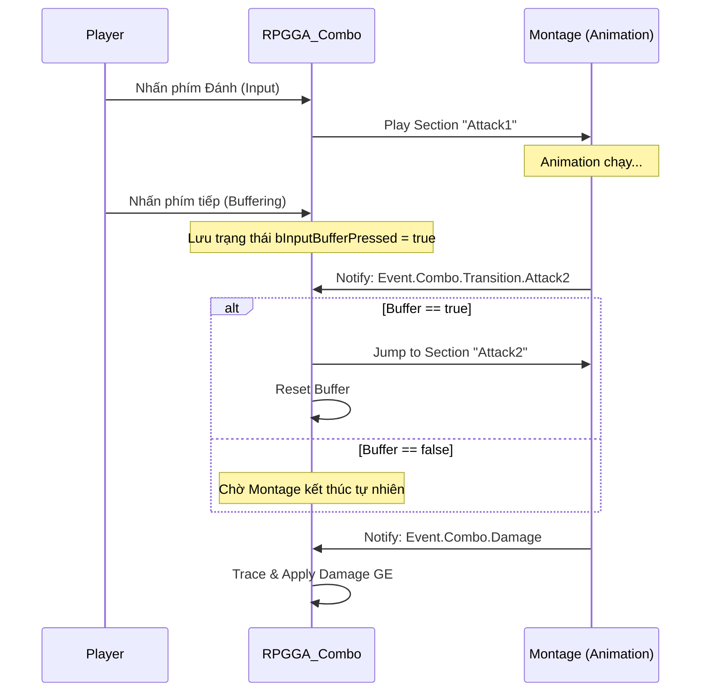

# Axe Combo System Implementation Plan

Hệ thống Axe Combo sẽ được xây dựng theo triết lý **"Pure Event-Driven"**: Logic C++ chỉ đóng vai trò "Trọng tài", còn nhịp độ (Rhythm) và sự chuyển đổi sẽ hoàn toàn do Animation Montage điều khiển thông qua Gameplay Events.

## 🔄 Luồng Logic Cốt lõi

## Proposed Changes

### 1. [C++] RPG Runtime Core

#### [NEW] [RPGGA_Combo.h](file:///f:/UnrealProject/LyraRPG/Lyra/Plugins/GameFeatures/RPG/Source/RPGRuntime/Public/AbilitySystem/Abilities/RPGGA_Combo.h)
#### [NEW] [RPGGA_Combo.cpp](file:///f:/UnrealProject/LyraRPG/Lyra/Plugins/GameFeatures/RPG/Source/RPGRuntime/Private/AbilitySystem/Abilities/RPGGA_Combo.cpp)
Tạo lớp cha cho mọi loại Combo (Axe, Sword, v.v.).
- **Tính năng chính**:
    - **Input Buffering**: Lắng nghe phím bấm khi đang trong "Action Window".
    - **Tag-Driven Transitions**: Nhảy Section dựa trên Tag gửi về từ Montage.
    - **State Control**: Tự động gỡ bỏ combo nếu không có input tiếp theo.

#### [NEW] [RPGAnimNotify_SendGameplayEvent.h/cpp](file:///f:/UnrealProject/LyraRPG/Lyra/Plugins/GameFeatures/RPG/Source/RPGRuntime/Public/Animation/RPGAnimNotify_SendGameplayEvent.h)
Lớp Notify tùy chỉnh để gửi tín hiệu từ Montage về cho Ability.
- **Tính năng**: Gửi Gameplay Tag thông qua `SendGameplayEventToActor`.
- **Editor**: Hiển thị tên Tag ngay trên Timeline để dễ quản lý.

#### [MODIFY] [RPGGameplayTags.h](file:///f:/UnrealProject/LyraRPG/Lyra/Plugins/GameFeatures/RPG/Source/RPGRuntime/Public/System/RPGGameplayTags.h)
render_diffs(file:///f:/UnrealProject/LyraRPG/Lyra/Plugins/GameFeatures/RPG/Source/RPGRuntime/Public/System/RPGGameplayTags.h)

#### [MODIFY] [RPGGameplayTags.cpp](file:///f:/UnrealProject/LyraRPG/Lyra/Plugins/GameFeatures/RPG/Source/RPGRuntime/Private/System/RPGGameplayTags.cpp)
render_diffs(file:///f:/UnrealProject/LyraRPG/Lyra/Plugins/GameFeatures/RPG/Source/RPGRuntime/Private/System/RPGGameplayTags.cpp)

---

### 2. [Editor] Axe Setup

#### Montage: `AM_Axe_Combo`
- Chia thành các Section: `Attack1`, `Attack2`, `Attack3`.
- Đặt Notify `AN_SendComboEvent`:
    - Tại điểm va chạm: Ghi Tag `Event.Combo.Damage`.
    - Tại cửa sổ chuyển tiếp: Ghi Tag `Event.Combo.Transition.Attack2` (để báo đòn tiếp theo).

#### Ability: `GA_Axe_Combo`
- Kế thừa từ `RPGGA_Combo`.
- Cấu hình Montage và Damage Map (GE sát thương cho từng đòn).

---

## Verification Plan

### Automated Tests
1. **Input Buffering Check**: Nhấn chuột nhanh 2 lần -> Character phải tự động chuyển từ Attack 1 sang Attack 2 khi tới Notify Transition.
2. **Combo Reset Check**: Đánh 1 đòn và đứng yên -> Character phải quay về trạng thái Idle và kết thúc Ability sau khi Montage kết thúc.
3. **Damage Sync Check**: Sát thương chỉ được áp dụng đúng tại thời điểm Notify Damage xuất hiện.

### Manual Verification
- Sử dụng `showdebug abilitysystem` để kiểm tra các Tag `Status.Action.Combo` có bật/tắt chính xác không.
- Kiểm tra cảm giác "nhạy" của combo bằng cách di chuyển Notify trên Timeline.
